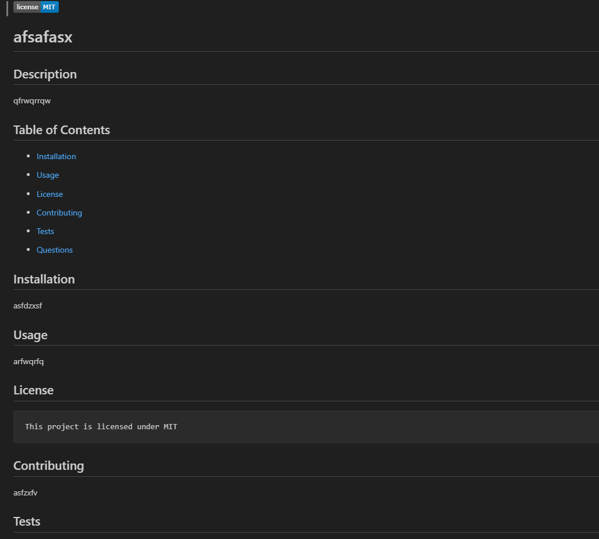
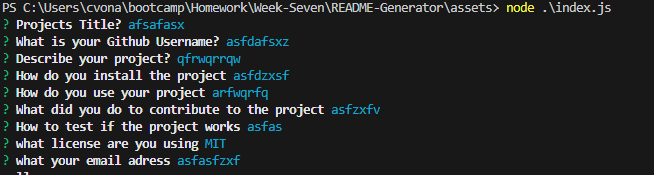

  # README Generator

  ## Description
  In this project I have made a generator for professional README'S which will allow users to focus more time on their actuall projects over making a whole README.

  ## Table of Contents
  * [Installation](#installation)

  * [Usage](#usage)

  * [Images](#images)

  * [Questions](#questions)

  ## Installation
  npm i

  ## Usage
  By going to the Terminal and typing 'node index.js' then answering all the question shown

  ## Images
  
  

  ## Questions
  Here are ways to contact me if you have any questions
  Github: [Link text](https://github.com/Christopher-VA)
  Email: [link text](cvonaltenstadt@gmail.com)
